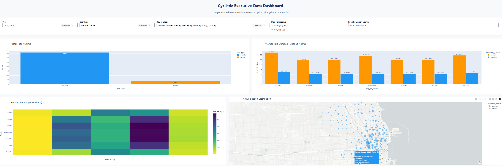

# 🚲 Cyclistic Executive Data Dashboard

> Interactive web application built with Python, Dash and Plotly to analyze bike-share behavior patterns.

[](https://python.org)
[](https://dash.plotly.com)
[](https://python-visualization.github.io/folium/)
[](https://render.com)

🔗 **[Live Dashboard → cyclistic-dashboard.onrender.com](https://cyclistic-dashboard.onrender.com)**

<sub>*(<span style="color:red"><b>Note:</b></span> Hosted on Render's free tier, the initial load may take a few seconds to spin up).*</sub>
---

## 📊 Project Overview

This dashboard is part of the **Google Data Analytics Capstone Project**. It processes over 150,000 cleaned records from the Divvy bike-share system (Chicago) to provide executive-level insights on how **Member** and **Casual** riders use the service differently.

The goal is to support a data-driven marketing strategy aimed at converting casual riders into annual members.

---

## 🔗 Related Resources

| Resource | Link |
|----------|------|
| 📓 Full Analysis — Jupyter Notebook | [View on Kaggle]([your-kaggle-notebook-link]) |
| 📄 Executive Presentation PDF | [View on Kaggle]([your-kaggle-presentation-link]) |

---

## 📸 Dashboard Preview



---

## ⚠️ Technical Note on Data

The complete dataset (Q1 2019 + Q1 2020) totals ~123 MB — exceeding the 25 MB file size limit on GitHub. The dashboard uses a random sample of 150,000 records drawn from the combined dataset (`all_trips_github.csv`). The sample predominantly reflects 2020 data, which represents the larger share of the full dataset. This does not affect the validity of the behavioral insights.

---

## ✨ Key Features

- **Real-time Filtering** — Filter by User Type, Day of the Week, and Station name
- **Outlier Management** — Automatically filters trips over 120 minutes to ensure realistic averages
- **Interactive Geospatial Map (Folium)**
  - 🔵 Blue circles = Member stations
  - 🟠 Orange circles = Casual stations
  - Circle size proportional to ride volume
  - Hover tooltips showing station names
  - Two views: Top 25 most active stations / All 635 stations
- **Behavioral Heatmaps** — Peak demand hours to assist in bike redistribution
- **Duration Analysis** — Average trip lengths (cleaned <120 min) by user type and weekday

---

## 🛠️ Technical Stack

| Tool | Purpose |
|------|---------|
| Python | Core language |
| Pandas | Data manipulation and feature engineering |
| Dash | Dashboard framework |
| Plotly Express | Charts (bar, histogram, heatmap) |
| Folium | Interactive geospatial map |
| Gunicorn | Production server (Procfile) |
| Render | Cloud deployment |

---

## 📁 Repository Structure

```
cyclistic-dashboard/
│
├── app.py                    # Main Dash application
├── clean_data.py             # Data cleaning and feature engineering
├── all_trips_github.csv      # Cleaned sample dataset (150K records)
├── dashboard_final.png       # Dashboard screenshot for README
├── requirements.txt          # Python dependencies
├── Procfile                  # Render deployment configuration
└── README.md
```

---

## 🏗️ Data Engineering

The following features were extracted from raw timestamps in `clean_data.py`:

| Feature | Method | Purpose |
|---------|--------|---------|
| `year` | `.dt.year` | Year filter |
| `day_of_week` | `.dt.day_name()` | Weekly pattern analysis |
| `hour` | `.dt.hour` | Peak demand identification |
| `ride_length` | `ended_at - started_at` (minutes) | Duration analysis |

---

## ⚙️ Run Locally

### 1. Clone the repository
```bash
git clone https://github.com/vik-Vicky/cyclistic-dashboard.git
cd cyclistic-dashboard
```

### 2. Install dependencies
```bash
pip install -r requirements.txt
```

### 3. Run the app
```bash
python app.py
```
Open `http://localhost:8050` in your browser.

---

*Developed as part of the Google Data Analytics Capstone Project · Victoria Dov · 2026*
